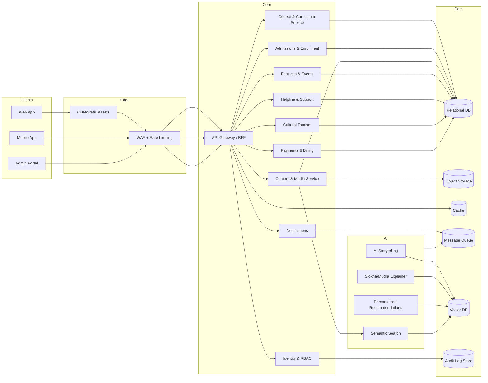

# ksg-platform
A digital Kuchipudi Gurukulam platform combining AI-powered storytelling, slokha and mudra explanations, courses, admissions, RBAC, admin portal, helpline, festivals, and cultural tourism support. Treating Kuchipudi as an art form, not just a tradition.

## Architecture
This project follows a layered, service-oriented architecture designed for multi-tenant cultural education platforms with AI-assisted learning. The system is split into presentation, API, domain services, AI/ML, and data layers, with shared infrastructure for security, observability, and delivery.

### High-level system view

### Presentation layer
- **Web App**: Public-facing portal for storytelling, courses, events, and tourism.
- **Mobile App**: Learner-first experience optimized for practice and lessons.
- **Admin Portal**: Back-office tools for admissions, content management, festivals, and operations.

### Edge & access
- **CDN/Static hosting** for fast delivery of media and front-end assets.
- **WAF + rate limiting** to protect public APIs and prevent abuse.
- **API Gateway / BFF** to unify request routing, versioning, and response shaping per client.

### Core domain services
- **Identity & RBAC**: User profiles, roles (student, instructor, admin), and permissions.
- **Course & Curriculum**: Modules, lessons, progress tracking, evaluations.
- **Admissions & Enrollment**: Application workflow, approvals, cohort assignment.
- **Content & Media**: Slokhas, mudras, audio/video, metadata, tagging.
- **Festivals & Events**: Scheduling, participation, announcements.
- **Helpline & Support**: Tickets, FAQs, escalation.
- **Cultural Tourism**: Itineraries, guides, heritage places, bookings.
- **Payments & Billing**: Fees, receipts, and reconciliation.
- **Notifications**: Email/SMS/push dispatch with templates and delivery tracking.

### AI/ML services
- **AI Storytelling**: Narrative generation and interactive cultural storytelling.
- **Slokha/Mudra Explainer**: Contextual explanations, pronunciation guidance, and visual cues.
- **Personalized Recommendations**: Course, practice, and content suggestions.
- **Semantic Search**: Search across slokhas, mudras, and curriculum content.

### Data layer
- **Relational DB**: Source of truth for users, courses, admissions, and events.
- **Object Storage**: Media assets (audio, video, images, documents).
- **Cache**: Session caching, hot content, and AI response caching.
- **Message Queue**: Async jobs (notifications, AI tasks, media processing).
- **Vector DB**: Embeddings for semantic search and AI retrieval.
- **Audit Log Store**: Immutable audit trail for compliance and admin actions.

### Security & compliance
- **RBAC** at API and service level.
- **PII protection** with encryption at rest and in transit.
- **Audit trails** for admin actions, admissions decisions, and payments.

### Observability & reliability
- **Centralized logging** with trace correlation across services.
- **Metrics & dashboards** for API latency, AI usage, and queue health.
- **Alerts** for error rates, failed jobs, and payment anomalies.

### Deployment model
- **Containerized services** deployed behind a load balancer.
- **Blue/green or rolling deployments** for minimal downtime.
- **Infrastructure as code** to standardize environments.

### CI/CD pipeline
- **Lint + tests** on every change.
- **Build & security scanning** for dependencies and containers.
- **Automated deployments** to staging and production with approvals.

### Data flow summary
1. Client requests hit the edge layer (CDN/WAF) and route to the API.
2. API authenticates and authorizes with RBAC.
3. Core services execute business logic and persist to the relational store.
4. Media goes to object storage, while AI-related requests go through the queue and vector store.
5. Notifications are sent asynchronously, with delivery events logged.
